# tt-ihp-vga-trng

A Tiny Tapeout tile for the **IHP 130nm open source PDK** shuttle: eight 640x480
VGA pattern generators sharing one sync generator, with the active pattern chosen
either from three input pins or by an on-chip true random number generator that
has von Neumann debiasing, LFSR conditioning and SP 800-90B style online health
tests. Output goes straight to a TinyVGA PMOD.

[](https://github.com/danieltyukov/tt-ihp-vga-trng/actions/workflows/test.yaml)
[](https://github.com/danieltyukov/tt-ihp-vga-trng/actions/workflows/gds.yaml)
[](https://github.com/danieltyukov/tt-ihp-vga-trng/actions/workflows/docs.yaml)

| | |
| --- | --- |
| Top module | `tt_um_danieltyukov_vga_trng` |
| Tiles | `1x2` ([why](#area-and-the-tile-decision)) |
| Clock | 25.175 MHz pixel clock, 640x480 at 59.9405 Hz |
| Hardened | LibreLane 3.0.0.dev44 on ihp-sg13g2: 25940 um2 of cells in a 167x216 um die, **DRC and LVS clean** |
| Timing | setup +17.56 ns post route at 39.722 ns, all three corners. Fmax 169 MHz at the slow corner |
| External hardware | [TinyVGA PMOD](https://github.com/mole99/tiny-vga) |
| Regression | 11 cocotb tests, 2.5 million pixels compared, all passing |
| Formal | debiaser symmetry and sync counter invariants proved with SymbiYosys, mutation checked |

## The hardened tile

| | |
| --- | --- |
| 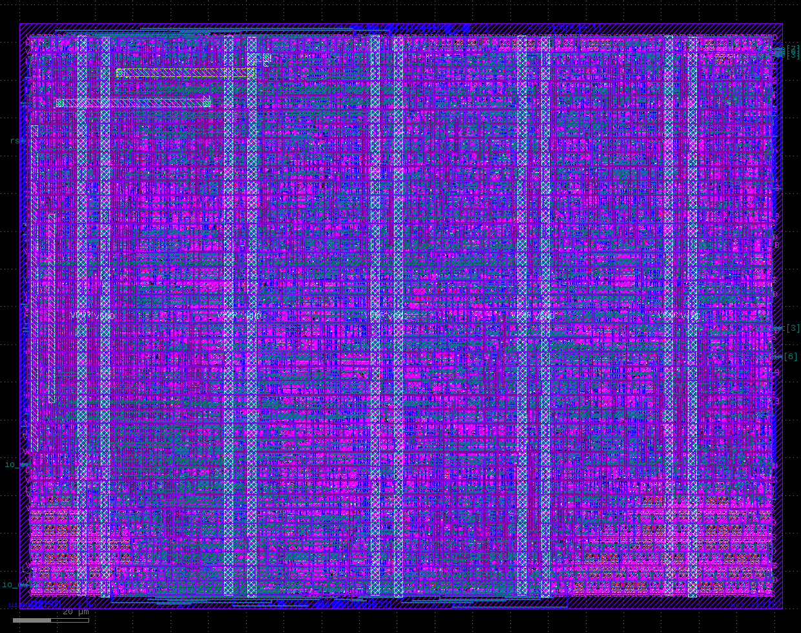 | 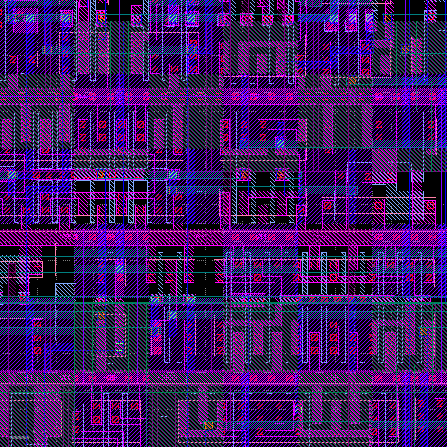 |
| The whole die, 167 x 216 um. Die outline, the pin frame around the edge, and the four vertical VPWR/VGND power straps. | A 12 x 12 um box near the centre at the same scale a designer would inspect: standard cell rows with their power rails, contacts, and metal2 routing between cells. |

**[Open the layout in the 3D chip viewer](https://gds-viewer.tinytapeout.com/?model=https://danieltyukov.github.io/tt-ihp-vga-trng/tinytapeout.oas&pdk=ihp-sg13g2)**
&nbsp;&nbsp;rotate and zoom the actual layout in a browser. Published to GitHub
Pages by the `viewer` job in [`gds.yaml`](.github/workflows/gds.yaml).

Hardened with **LibreLane 3.0.0.dev44** on `ihp-sg13g2`, the same tool version and
PDK that `TinyTapeout/tt-gds-action@ttihp26a` pins, both locally via `make harden`
and in CI. Signoff from that run:

| | | | |
| --- | --- | --- | --- |
| die area | **36072 um2** (167 x 216) | route DRC | **0** |
| real cell area | **25940.5 um2**, 1767 cells | magic DRC | **0** |
| fill cells | 7489.8 um2, 1198 cells | klayout DRC | **0** |
| setup worst slack | **+17.5583 ns** at 39.722 ns | LVS | **0** |
| hold worst slack | +0.1168 ns | antenna | **0** nets, **0** pins |
| clock skew | 0.0327 ns | power grid | **0** |
| power | 0.3440 mW | unmapped cells | **0** |
| wirelength | 38024 um | max slew / max cap | **0** / **0** |

Tiny Tapeout's own **`precheck` job passes** on this repository, so the tile
clears their submission checks.

**This is a hardened layout, not fabricated silicon.** Nothing here has been
submitted to a shuttle and nothing has been manufactured. What the numbers above
establish is that the design places, routes and passes DRC and LVS on the real
PDK. Fabrication requires submitting to a Tiny Tapeout shuttle, which is a
separate step this repository does not perform.

## Pattern gallery

Every image below is a real frame captured off the tile's `uo_out` pins in an
Icarus simulation and checked pixel by pixel against an independent Python model
before being written. None of them is a mockup.

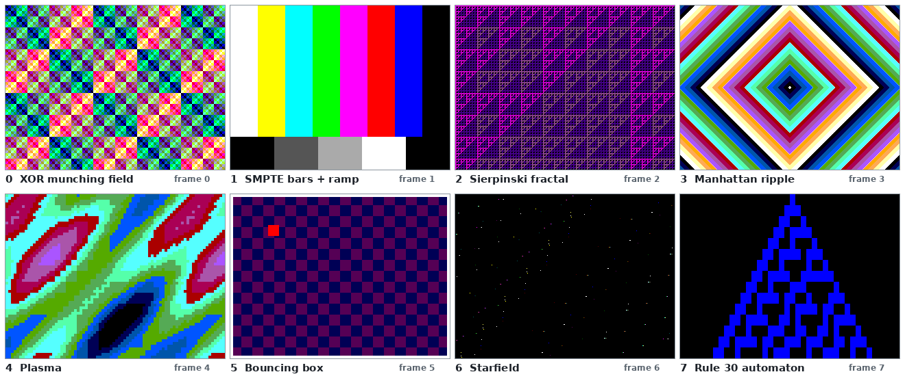

| `SEL` | pattern | state | area | notes |
| --- | --- | --- | --- | --- |
| 0 | XOR munching field | none | 434 um2 | `(x ^ y) + frame`, palette scrolls diagonally |
| 1 | SMPTE style bars + grey ramp | none | 403 um2 | bar index is `(x >> 4) / 5` as a compare chain |
| 2 | Sierpinski bit fractal | none | 152 um2 | `(x & y) == 0`, three nested layers from one AND |
| 3 | Manhattan ripple | none | 953 um2 | `abs(x-320) + abs(y-240) - frame`, rings travel outward |
| 4 | Plasma | none | 1310 um2 | three interfering sines over a folded quarter wave table |
| 5 | Bouncing box | 24 ff | 3346 um2 | 32x32 box, 2 px/frame, colour cycles on collision |
| 6 | Starfield | none | 131 um2 | star wherever `lfsr[9:0] == 0`, measured 293 stars/frame |
| 7 | Rule 30 automaton | 40 ff | 4209 um2 | 40 cells, one generation per 32 scanlines |

Full resolution single pattern captures are in `docs/img/`, one file per pattern:
[`pattern_xor_field.png`](docs/img/pattern_xor_field.png),
[`pattern_smpte_bars.png`](docs/img/pattern_smpte_bars.png),
[`pattern_sierpinski.png`](docs/img/pattern_sierpinski.png),
[`pattern_ripple.png`](docs/img/pattern_ripple.png),
[`pattern_plasma.png`](docs/img/pattern_plasma.png),
[`pattern_bouncing_box.png`](docs/img/pattern_bouncing_box.png),
[`pattern_starfield.png`](docs/img/pattern_starfield.png),
[`pattern_rule30.png`](docs/img/pattern_rule30.png).

Six of the eight are pure combinational functions of `(pix_x, pix_y, frame_cnt)`.
That is not a stylistic choice: a 640x480 frame at 6 bits per pixel is 1 843 200
bits, and the whole tile holds 142 flip-flops. Even one scanline would be 3840
bits. There is no framebuffer because there is nowhere to put one.

### Animation

The ripple pattern over 32 consecutive verified frames, and the TRNG choosing a
new pattern every 8 frames with `RAND_EN` set:

| animated pattern | TRNG driven selection |
| --- | --- |
| 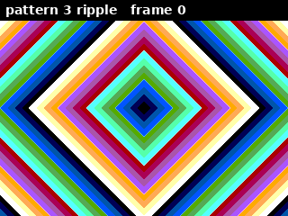 | 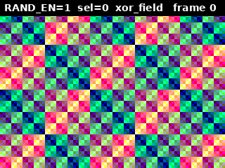 |

In the right-hand GIF the pattern index is not chosen by the testbench. It is read
out of the DUT's own `sel_rand` register, asserted equal to the model's, and then
used as the expected pattern for the pixel comparison of that frame. Entropy was
driven into `ENT_IN` during vertical blanking, which is where it has to arrive to
influence the reselect at the frame boundary.

## VGA timing

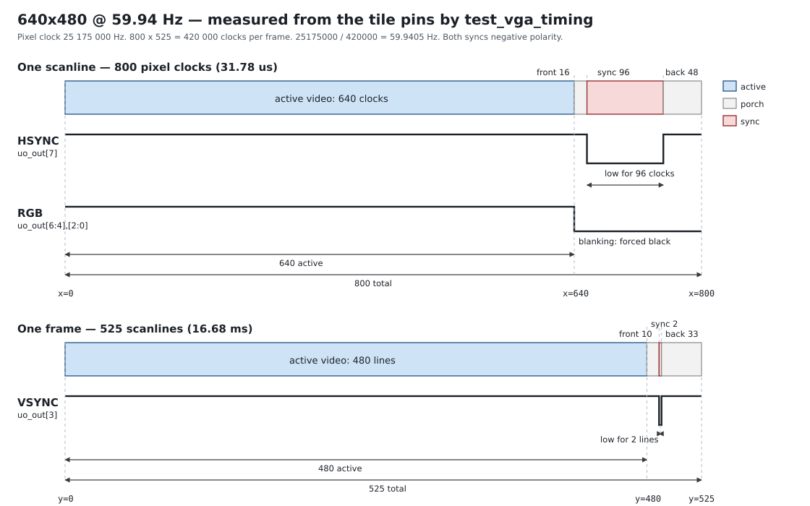

`test_vga_timing` derives all eight intervals from `uo_out` alone, with no
internal signal read anywhere, and asserts each number:

```
horizontal: active=640 front=16 sync=96 back=48 total=800
vertical:   active=480 front=10 sync=2  back=33 total=525
frame rate: 420000 clocks per frame -> 59.9405 Hz
both syncs negative polarity (idle high, pulse low)
```

Pattern 5 is used as the probe because every pixel of its visible area is
non-black, so the black to non-black transition on the pins marks the active
window exactly.

## Pin map

Every used pin is labelled here and in [`info.yaml`](info.yaml). No pin is used
without a name.

### Inputs `ui_in`

| pin | name | function |
| --- | --- | --- |
| `ui_in[2:0]` | `SEL` | manual pattern select, 0 to 7. Used when `RAND_EN` is low |
| `ui_in[3]` | `RAND_EN` | 1 selects the pattern from the TRNG instead of `SEL` |
| `ui_in[4]` | `HEALTH_CLR` | clears both sticky health flags while high |
| `ui_in[5]` | `FAST_SW` | random reselect every 8 frames instead of every 64 |
| `ui_in[6]` | `FREEZE` | holds the frame counter, so animation stops |
| `ui_in[7]` | `SAMP_FAST` | sample entropy every clock instead of every 8 clocks |

### Outputs `uo_out` (TinyVGA PMOD)

`uo_out = {hsync, B0, G0, R0, vsync, B1, G1, R1}`, 2 bits per channel, 64 colours.

| pin | name | | pin | name |
| --- | --- | --- | --- | --- |
| `uo_out[0]` | `R1` red MSB | | `uo_out[4]` | `R0` red LSB |
| `uo_out[1]` | `G1` green MSB | | `uo_out[5]` | `G0` green LSB |
| `uo_out[2]` | `B1` blue MSB | | `uo_out[6]` | `B0` blue LSB |
| `uo_out[3]` | `VSYNC` negative | | `uo_out[7]` | `HSYNC` negative |

### Bidirectional `uio`, `uio_oe = 8'b1110_0000`

| pin | dir | name | function |
| --- | --- | --- | --- |
| `uio[0]` | in | `ENT_IN` | external entropy bit, XORed into the noise source |
| `uio[2:1]` | in | `RCT_CUT` | repetition count cutoff: 4, 8, 16, 32 |
| `uio[4:3]` | in | `APT_CUT` | adaptive proportion cutoff: 40, 48, 56, 62 of 64 |
| `uio[5]` | out | `RCT_FAIL` | repetition count test sticky failure flag |
| `uio[6]` | out | `APT_FAIL` | adaptive proportion test sticky failure flag |
| `uio[7]` | out | `RND_OUT` | conditioned random bit stream, gated on health |

## TRNG architecture

```
ring_osc(5) \                                        +--> health_monitor (RAW samples)
             XOR -> sync -> entropy_source -> raw_bit
ring_osc(7) /          or the ENT_IN pin              +--> von_neumann -> lfsr_whitener
                                                                              |
                                          state[15:0] -> starfield pattern <---+
                                          state[2:0]  -> pattern select   <---+
                                          state[15]   -> RND_OUT pin, health gated
```

Full detail, including the SP 800-90B rationale, is in
[docs/design.md](docs/design.md). The parts worth knowing before trusting
anything:

### The ring oscillators cannot be simulated, and pretending otherwise is the trap

A free running ring oscillator has no meaning in an event driven simulator. Icarus
will happily oscillate a delay annotated inverter loop, and `test/tb_ring.v`
measures the result: **exactly 30 ns for the 5 stage ring and exactly 28 ns for
the 7 stage ring**, which is `2 * STAGES * SIM_DELAY` to the picosecond. A square
wave with zero jitter. Sampling it gives a deterministic sequence, and any
statistics gathered through it describe the simulator's timewheel.

So `entropy_source` has two paths. `SIM_ENTROPY = 0` keeps the ring oscillators
and is what gets taped out; it is verified structurally only. `SIM_ENTROPY = 1`
takes the raw bit from `ENT_IN` and elaborates no oscillator, which makes the
debiaser, the conditioner and both health tests bit exact checkable against a
Python model. `test/tb.v` selects the second for RTL simulation. Both builds XOR
`ENT_IN` in, so an external noise source works in silicon too.

### The optimiser will destroy a ring oscillator silently

Written as one expression inside a single module, the mapper collapses the odd
inverter chain to a single inverter. Measured with Yosys 0.33 against the sg13g2
library: **2 surviving cells instead of 12**. Both oscillators become one inverter
plus one AND gate, their frequencies become identical, and the XOR of two
identical oscillators is a constant. The noise source silently becomes a wire tied
low and every downstream check still passes.

The fix is one `(* keep_hierarchy *)` module per stage plus `(* keep *)` on the
chain nodes. `make synth` counts the surviving stages and **fails the build** if
there are not 12.

### The conditioner is linear, and the statistics measure it, not silicon

```
x^16 + x^15 + x^13 + x^4 + 1
```

with the de Bruijn zero state correction, so the period is 65536 rather than
65535, the all-zero state cannot lock the register up, and one period of output
carries exactly 32768 ones. `test_lfsr_period` walks the whole cycle and asserts
all 65536 states are visited.

An LFSR is a decorrelator and a rate matcher, **not** a cryptographic
conditioner. Sixteen consecutive output bits reveal the whole state. Do not treat
`RND_OUT` as a CSPRNG or as full entropy per bit. Doing it properly needs a sponge
or a block cipher, and neither fits in this tile.

Measured over 262144 output bits:

| | |
| --- | --- |
| bias | -0.00012, asserted within +/-0.01 |
| runs of length 1 | 0.5001 of 130757 runs |
| longest run | 17 bits |
| byte chi-square | 214.1 on 255 df (critical value 330.5 at p = 0.001) |
| von Neumann | bias +0.2496 to +0.0031, yield 0.1872 vs theoretical 0.1875 |

| | |
| --- | --- |
| 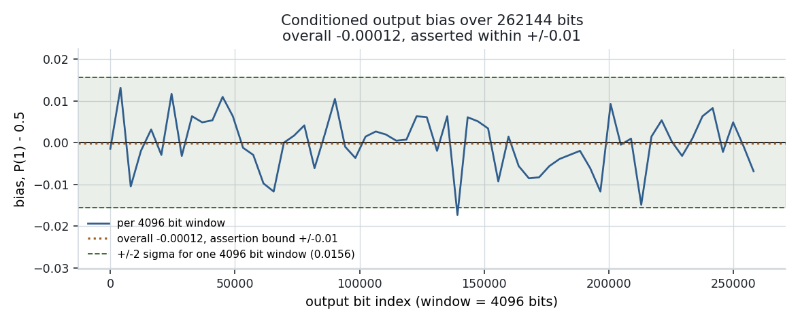 | 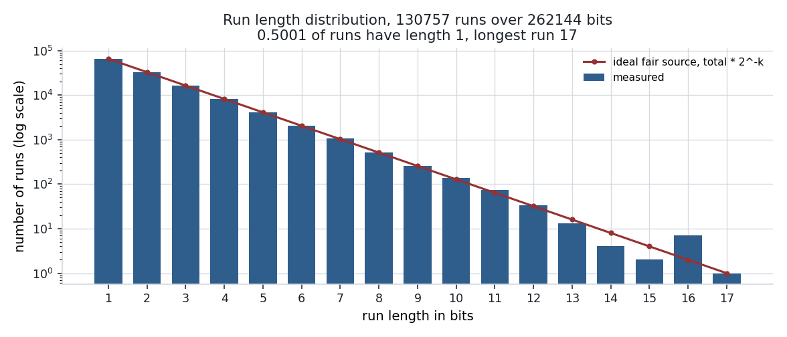 |
| 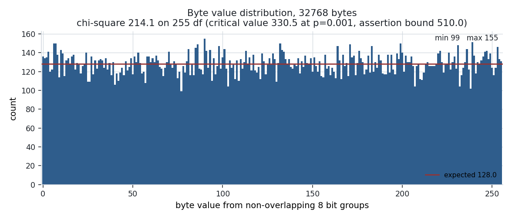 | 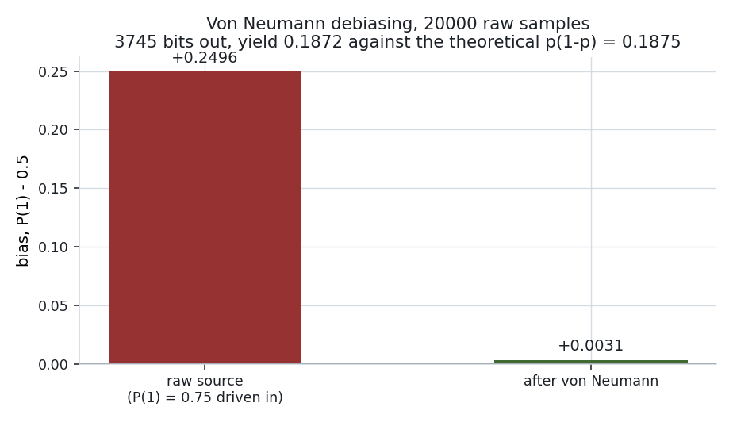 |

**None of this measures silicon entropy.** The entropy input for those runs was a
Python pseudorandom generator driven into `ENT_IN`, because the ring oscillators
cannot be simulated. What the numbers are worth is that a wrong tap set, a stuck
output, a broken debiaser, a health test firing on fair input, or an accidentally
gated output all fail immediately.

### Health tests run on the raw samples, on purpose

Both tests tap the noise source before the debiaser and before the conditioner,
which is what SP 800-90B asks for. A stuck-at-0 source produces perfectly healthy
looking LFSR output forever, and a debiaser fed a constant simply stops emitting,
which is indistinguishable from a slow source.

- **Repetition count**, cutoff 4/8/16/32 selectable. Fires on the sample that
  completes a run of exactly the cutoff.
- **Adaptive proportion**, window 64, cutoff 40/48/56/62 selectable. Catches a
  source that drifted heavily biased without ever getting stuck long enough to
  trip the repetition test. `test_health_apt` proves the separation by using a
  stream whose longest run is 15, invisible to a cutoff of 32, while 60 of every
  64 samples match the window reference.

Both flags are sticky until `HEALTH_CLR`. While either is set, `RND_OUT` is held
low and the random reselect is inhibited, which is the standard's "stop producing
output once the source has failed" rule.

## Area and the tile decision

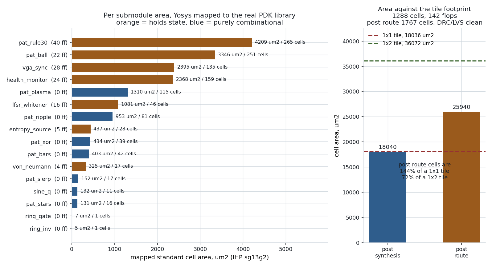

Three numbers, from three different points in the flow, all on the real
`sg13g2` library from
[IHP-Open-PDK](https://github.com/IHP-GmbH/IHP-Open-PDK):

| stage | cell area | tool |
| --- | --- | --- |
| post synthesis | 18040 um2, 1288 cells, 142 flip-flops | Yosys 0.33, `stat -liberty` |
| post route, real cells | **25940 um2, 1767 cells** | LibreLane 3.0.0.dev44 |
| post route, plus fill | 33430 um2, 2965 instances | same run |

The post route figure is the one that decides the tile count, and it settles the
question outright:

| tiles | die area | post route cells as a fraction | verdict |
| --- | --- | --- | --- |
| 1x1 | 18036 um2 | **143.8%** | impossible: more cell area than there is die |
| 1x2 | 36072 um2 | **71.9%** | hardened, routed, DRC and LVS clean |

A 1x1 tile is not a tight fit for this design, it is arithmetically ruled out.
There is half again as much silicon in the cells as there is tile to put them in,
before a single wire is routed.

Where the 7900 um2 between synthesis and route goes is worth knowing, because it
is the part a synthesis-only estimate misses entirely:

| class | area | count |
| --- | --- | --- |
| multi-input combinational | 11404 um2 | 1161 |
| sequential (flip-flops) | 7076 um2 | 142 |
| timing repair buffers | 5846 um2 | 338, of which 233 are hold buffers |
| clock tree buffers and inverters | 1247 um2 | 65 |
| inverters and buffers | 368 um2 | 61 |
| fill | 7490 um2 | 1198 |

Hold fixing alone is 5846 um2, 23% of the real cell area. Anyone sizing a Tiny
Tapeout tile from a `yosys stat` number is going to be about 40% optimistic.

`make synth` fails the build on any blackbox, any inferred latch, or any ring
oscillator stage lost to the optimiser. `scripts/check_area.py`, which the CI
synth job runs, compares a fresh report against the committed one within 2% and
independently re-derives the required tile count from the measured area, so the
`tiles` field in `info.yaml` cannot drift away from the measurement. Reports are
committed in [docs/synth/](docs/synth/) and [docs/hardening/](docs/hardening/).

## Hardening and timing closure

The `gds` workflow needs Tiny Tapeout's shuttle infrastructure, but the
hardening flow itself does not: LibreLane **3.0.0.dev44** with `pdk:
ihp-sg13g2` is exactly what `TinyTapeout/tt-gds-action@ttihp26a` pins, so
`make harden` runs the shuttle flow rather than an approximation of it.

```
die area            36072.0 um2   167 x 216, the 1x2 tile footprint
real cell area      25940.5 um2   1767 cells
fill cells           7489.8 um2   1198 cells
setup worst slack    17.5583 ns   at a 39.722 ns period
hold worst slack      0.1168 ns
clock skew            0.0327 ns   network latency 0.68 to 0.72 ns
power                 0.3440 mW
wirelength              38024 um

route DRC 0    magic DRC 0    klayout DRC 0    LVS 0
antenna 0 nets, 0 pins        power grid 0     unmapped cells 0
max slew 0     max cap 0      setup TNS 0      hold TNS 0
```

Post route timing at all three corners LibreLane signs off on:

| corner | setup worst slack | hold worst slack |
| --- | --- | --- |
| slow 1.08 V 125 C | +17.5583 ns | +0.6219 ns |
| typ 1.20 V 25 C | +18.3220 ns | +0.3024 ns |
| fast 1.32 V -40 C | +18.7628 ns | +0.1168 ns |

Those numbers are measured against [`hardening/constraints.sdc`](hardening/constraints.sdc),
a real SDC, not the generic fallback LibreLane substitutes when
`PNR_SDC_FILE` is unset. It budgets 25% of the clock period at each boundary for
the harness input and output mux, models the boundary with `sg13g2_inv_1` drive
and load, and gives a reason for every number in it. A slack figure from a
fallback SDC would not be worth quoting.

### Does the declared clock actually close?

`info.yaml` says `clock_hz: 25175000`. `make sta` proves it, with OpenSTA 3.1.0
on netlists mapped per corner (`dfflibmap` and `abc` pick cells from whichever
liberty they are handed, so a slow corner timing report has to run on a slow
corner netlist):

| corner | setup slack at 39.722 ns | hold slack | Fmax | margin over 25.175 MHz |
| --- | --- | --- | --- | --- |
| slow 1.08 V 125 C | +33.8093 ns | +0.0989 ns | 169.13 MHz | 6.72x |
| typ 1.20 V 25 C | +35.9221 ns | +0.0643 ns | 263.16 MHz | 10.45x |
| fast 1.65 V -40 C | +37.9347 ns | +0.0350 ns | 559.50 MHz | 22.22x |

Total negative slack is 0.0 at every corner. The setup critical path is 5.70 ns
at the slow corner, running from a `vga_sync` counter flop through the `gen_end`
term into the rule 30 row register. `scripts/parse_sta.py` fails the run if setup
does not close at the signoff corner, so the `clock_hz` claim cannot silently rot.

The post synthesis Fmax (169 MHz) is higher than the post route slack implies
because post synthesis STA estimates interconnect from the liberty wireload
model, while the hardened number includes extracted parasitics, the real clock
tree and the hold buffers. Both are reported rather than just the flattering one.

### One violation that is not clean, stated plainly

`design__max_fanout_violation__count` is **1**. The clock tree root buffer
`clkbuf_0_clk/X` drives 16 sinks against the library's `default_max_fanout` of 8.

It is left as it is, with the reasoning written down rather than the number
hidden: `max_fanout` is a proxy design rule for slew and capacitance, and both of
the things it stands in for are clean at every corner (max slew 0, max cap 0).
The clock tree it produced has 33 ps of skew and 0.68 to 0.72 ns of latency, and
setup and hold both close with margin. See
[docs/design.md](docs/design.md#the-one-violation-that-is-not-clean) for what was
tried.

### Ring oscillator frequency, calculated not measured

The real PDK gives real inverter delays, so the expected oscillation frequency
can be derived instead of guessed. `scripts/ring_freq.py` interpolates the
`sg13g2_inv_1` and `sg13g2_nand2_1` delay tables at the self-loaded capacitance,
solving for a self consistent input slew, and computes
`T = 2 * (t_nand + (N-1) * t_inv)`:

| corner | inverter delay | 5 stage ring | 7 stage ring | oscillator periods per sample at /8 |
| --- | --- | --- | --- | --- |
| slow 1.08 V 125 C | 38 ps | 2376 MHz | 1742 MHz | 554 |
| typ 1.20 V 25 C | 25 ps | 3677 MHz | 2686 MHz | 854 |
| fast 1.65 V -40 C | 14 ps | 6741 MHz | 4898 MHz | 1557 |

**This is a hand calculation from Liberty tables, not a measurement.** It
excludes interconnect, so real rings on silicon will be slower than every figure
in that table. It is quoted because the conclusion survives a large error bar:
even at the slow corner, and even if routing halved these frequencies, the
default divide-by-8 sample rate still gives hundreds of oscillator periods per
sample for jitter to accumulate in. That is what `SAMP_FAST` exists to let you
adjust once the real number is known.

## Simulating and testing locally

Everything runs through a repo local venv, so no shell activation is needed.

```sh
make venv     # create .venv and install test/requirements.txt
make test     # the cocotb regression, about 6 minutes
make lint     # verilator --lint-only -Wall, zero warnings expected
make ring     # ring oscillator structural testbench, plain Icarus
make synth    # Yosys area report against the real IHP liberty (needs network once)
make capture  # 64 further model-verified frames for the animated images, ~16 min
make sta      # OpenSTA timing closure across three real IHP corners
make harden   # LibreLane hardening to GDS, DRC and LVS signoff, layout renders
make fpga     # yosys + nextpnr-ice40 + icepack for an ICE40UP5K
make formal   # SymbiYosys proofs of the debiaser and sync generator
make ring-freq # ring oscillator frequency from the Liberty delay tables
make images   # regenerate every PNG and GIF in docs/img from simulation output
make check    # lint + ring + formal + test + synth
```

Requires `iverilog`, `verilator`, `yosys` and Python 3.11+ for the simulation and
synthesis targets. Tested with Icarus 12.0, Verilator 5.020, Yosys 0.33 and
cocotb 2.0.1.

`make sta` additionally needs `openroad` (OpenSTA 3.1.0) and an installed
`ihp-sg13g2` PDK; `make harden` needs `librelane` 3.0.0.dev44 and `klayout`. Both
default to `/home/danieltyukov/.local/share/pdk/IHP-Open-PDK/ihp-sg13g2` and take
`PDK_ROOT_IHP` as an override. `make synth` works without an installed PDK: it
falls back to fetching the one liberty file it needs.

`make images` reads what `make test` and `make capture` left in `test/output/`, so
run those first. `make capture` is a further 64 frames of simulation, about 16
minutes; those frames are verified against the model too, so it is a test as well
as an image source.

Gate level simulation, once the netlist exists:

```sh
cp runs/wokwi/results/final/verilog/gl/tt_um_danieltyukov_vga_trng.v test/gate_level_netlist.v
make -C test -B GATES=yes
```

The hardened netlist has no parameters, so GL simulation exercises the ring
oscillator path. The VGA timing and reset tests are meaningful there; the entropy
pipeline tests are not, because they need the deterministic source.

### What the test suite actually asserts

| test | assertion |
| --- | --- |
| `test_reset` | no output x or z, `uio_oe == 0b11100000`, syncs idle high at (0,0), health flags clear, LFSR reloads its seed, mid frame reset returns to the (0,0) state, and equal clock counts after reset give equal pixels |
| `test_vga_timing` | 640/16/96/48 and 480/10/2/33 measured from the pins, both totals, both polarities, 59.9405 Hz |
| `test_golden_frames` | 8 frames, 2 457 600 pixels, all pixel exact against `test/model.py`, all pairwise distinct, none flat |
| `test_pattern_switch_mid_frame` | `sel` changed at (321,200): sync exact on all 420 000 clocks, 128 321 pixels matched the old pattern and 178 879 the new one |
| `test_von_neumann` | all four pair cases, then 20 000 biased samples: bias +0.2496 to +0.0031, yield 0.1872 |
| `test_lfsr_sequence` | 8 000 steps against the model, free running and with entropy injection |
| `test_lfsr_period` | all 65 536 states visited including zero, seed recurs at exactly step 65 536 |
| `test_health_rct` | fires on the sample completing a run of exactly the cutoff, all four cutoffs, no false positive on alternating input |
| `test_health_apt` | fires on 60-of-64 bias at three cutoffs, ignores it at 62, no false positive on 4096 fair samples, repetition flag clear throughout |
| `test_health_sticky` | flag survives 256 healthy samples, gates the output on the 126 clocks where the LFSR bit was 1, clears on demand, then ungates |
| `test_trng_statistics` | bias within bound, runs distribution sane, byte chi-square under bound, no health test fires on fair input |

Plus `test/tb_ring.v` with 12 structural checks on the ring oscillator path, and
`test/capture.py` with 64 further model-verified frames.

### Formal verification

`make formal` runs SymbiYosys on the two blocks where a proof is worth more than a
test:

| target | what is proved | scope |
| --- | --- | --- |
| `von_neumann` | nothing is emitted without a completed pair; **01 emits 0, 10 emits 1, equal pairs emit nothing**; two consecutive output strobes are impossible | bounded, 40 cycles from reset |
| `vga_sync` | counters stay inside 0..799 and 0..524; syncs are low only inside their windows and never inside the visible area; `active` matches the visible window exactly; `line_end` and `frame_end` only at the ends; the counters advance by exactly one and wrap | unbounded, base case plus one step induction |

The debiaser property is the one that matters. The README's unbiasedness claim
rests on P(01) = P(10) for independent samples, so a debiaser that emits 0 on
exactly 01 and 1 on exactly 10 is unbiased by construction. Checking that against
two streams shows it worked twice. Proving the symmetry shows it always holds. The
statistical step still needs the input samples to be independent, which is an
assumption about the noise source that no tool can prove.

The sync generator is structured as a real induction: a base task forces a reset
and proves the counters land on (0,0), and a step task assumes only that they
start somewhere legal and proves one clock preserves every property. That is
unbounded, and it is also far cheaper than bounded checking from reset, which
needs 656 cycles just to reach the sync window and was taking ten seconds per step
at step 220.

`make formal` also runs a **mutation check**, because a proof that passes on a
broken design proves nothing: it injects two specific bugs, a `line_end` that
fires one pixel early and a debiaser that emits the second bit of the pair, and
fails if either proof still passes. Both are caught.

Two honest notes. The debiaser result is bounded rather than unbounded because
z3 4.8.12, the version available here, does not converge on the induction step
for that miter, and no newer solver was installable (`yices2` is not packaged,
`boolector` is the 2012 release, `cvc5` would not install). And these are two
blocks, not the whole tile: the pattern generators and the health monitor are
covered by simulation only.

## CI jobs and what they need

| workflow | jobs | status here |
| --- | --- | --- |
| `test.yaml` | lint, ring, cocotb, synth | **passing**, badge above |
| `gds.yaml` | gds, precheck, viewer | **passing**, badge above |
| `docs.yaml` | datasheet render | **passing**, badge above |
| `fpga.yaml` | ice40 bitstream | off by default (`branches: none`), as in the template. The flow it wraps is validated locally, see below |

All of these run on plain `ubuntu-24.04` runners with no secrets and no Tiny
Tapeout API access. There is no badge for `fpga.yaml` because it never runs on
push, so a badge would report nothing.

### The gl_test job was removed, and why

The template's `gds.yaml` ships a fourth job, `gl_test`, which re-runs the
testbench against the hardened gate-level netlist. It is **removed here**, not
silently disabled, because it cannot pass for this design:

`src/ring_osc.v` is a deliberate combinational loop and it has to survive
synthesis for the TRNG to exist at all, so the hardened netlist contains a five
inverter and a seven inverter ring. The IHP functional cell models are zero delay
(`sg13g2_inv_1` is `not (Y, A);` with a `0.0` specify block), so once `rst_n`
releases and the enable gate opens, an event driven simulator has a zero delay
feedback loop and stops advancing in time.

Measured locally rather than assumed: the netlist elaborates, `uio_oe` reads the
correct `0b11100000` through the tie cells, simulation runs normally while `rst_n`
is low and the ring is gated off, and then makes no further progress. On this
repository the job sat `in_progress` for 1h51m before removal.

This is inherent to gate level simulation of any ring oscillator against zero
delay models, not something fixable in the RTL. What covers the same ground
instead: the 11 test cocotb suite at RTL, `test/tb_ring.v` for the oscillator
path structurally, and the surviving-stage-count check in `make synth` which
fails the build if the optimiser collapses either ring.

`test/Makefile` still supports `make -B GATES=yes`, including a fix the stock
template needs: `sg13g2_udp.v` has to be read before `sg13g2_stdcell.v` or
elaboration fails with 154 unknown module errors for `ihp_dff_r`, `ihp_mux2` and
`ihp_mux4`. It runs [`test/test_gl.py`](test/test_gl.py), which checks the part
that is simulatable and passes: the netlist elaborates against the PDK models,
`uio_oe` reads exactly `0b11100000` through the tie cells, and time advances
normally while `rst_n` is low and the ring is gated off. It logs the unresolved
`uo_out` as an observation rather than asserting either way about it.

### The FPGA path, also validated locally

`make fpga` runs yosys `synth_ice40`, `nextpnr-ice40`, `icepack` and `icetime` for
an **ICE40UP5K in sg48**, the device Tiny Tapeout's FPGA emulator uses:

```
ICESTORM_LC     678 / 5280   12%
SB_IO            26 /   96   27%
SB_GB             6 /    8   75%
BRAM, DSP, PLL, SPRAM        0%      (no framebuffer, so nothing to store)
bitstream                104090 bytes

register to register   33.27 MHz against 25.175 MHz, 1.32x  PASS
clock to output pad     42.56 ns against a 39.72 ns pixel period, over budget
```

The register to register frequency is what decides whether the design runs, and
it passes. The clock to output pad path does not fit inside one pixel period, and
that is reported rather than left out: there is no PCF and no output delay
constraint in this run, because inventing pin numbers for a board nobody has would
be worse than not constraining them. On a real board that path needs real pin
constraints and probably an output register stage. It does not affect the ASIC,
where those ports go to the Tiny Tapeout harness rather than to pads, and where
the hardened run closes with 17.56 ns of slack.

This is built through [`fpga/fpga_top.v`](fpga/fpga_top.v), a wrapper that exists
for two real reasons. The raw tile has 43 ports and sg48 has 39 usable I/O, and
`synth_ice40` will not build a combinational loop, so the tile is instantiated
with `SIM_ENTROPY = 1` and entropy comes from the `ENT_IN` pin. That is the right
choice on an FPGA anyway: routed LUTs cannot host a usable ring oscillator TRNG,
so entropy has to come from outside, and whatever you feed that pin is not a TRNG.

No `fpga` badge is added, and that is deliberate. A badge points at the workflow,
`fpga.yaml` is `branches: none` as in the template so it never runs on push, and a
badge for a workflow that never runs would say nothing true. The evidence is the
numbers above and [docs/fpga/](docs/fpga/).

## Repository layout

```
src/                 20 Verilog files, one module each
  tt_um_danieltyukov_vga_trng.v   top level, pin map, select logic
  vga_sync.v                      800x525 counters
  pattern_mux.v                   the eight generators and the 8:1 mux
  pat_*.v, sine_q.v               the pattern generators
  trng.v                          entropy pipeline top
  ring_inv.v ring_gate.v ring_osc.v   protected ring oscillator stages
  entropy_source.v                prescaler, path select, synchroniser
  von_neumann.v                   debiaser
  lfsr_whitener.v                 conditioner and pixel rate PRNG
  health_monitor.v                repetition count and adaptive proportion tests
  config.json                     Librelane config, template default
test/
  test.py                         the 11 test regression
  model.py                        independent cycle accurate reference model
  tbutil.py                       reset, lockstep stepping, frame capture
  capture.py                      animation frame capture, also model verified
  tb.v                            cocotb wrapper, selects SIM_ENTROPY=1
  tb_ring.v                       ring oscillator structural testbench
  test_gl.py                      what is checkable on the hardened netlist
scripts/
  synth_report.sh                 Yosys area report against the real IHP liberty
  parse_synth.py                  Yosys text to docs/synth/area.json
  frames.py                       read the raw frame dumps
  make_images.py                  regenerate every raster image in docs/img
hardening/
  config.json                     LibreLane config for the local hardening run
  constraints.sdc                 real timing constraints, not the fallback
fpga/
  fpga_top.v                      iCE40 demo wrapper, SIM_ENTROPY=1
formal/
  von_neumann_fv.v, *.sby         debiaser symmetry proof
  vga_sync_fv.v, *.sby            sync counter invariants, base plus step
docs/
  info.md                         shuttle datasheet
  design.md                       area budget, pattern costs, entropy design
  synth/                          committed Yosys area reports
  sta/                            OpenSTA per corner reports, ring frequency
  hardening/                      LibreLane metrics and signoff
  fpga/                           iCE40 utilisation and timing
  formal/                         SymbiYosys task results
  img/                            hand written SVGs, generated PNGs and GIFs,
                                  and the two routed layout renders
```

## Honesty notes

Collected in one place so none of it has to be dug out of the prose:

- Nothing in this repository measures entropy from silicon. The ring oscillator
  path is verified structurally: it oscillates, it stops when disabled, the two
  rings have different periods, and all 12 stages survive synthesis. Its
  statistical behaviour is not and cannot be tested in an event simulator.
- Every statistical figure quoted was produced with a Python pseudorandom
  generator driven into `ENT_IN`. They characterise the debiaser and the LFSR
  conditioner.
- The LFSR conditioner is linear. `RND_OUT` is not a CSPRNG.
- The correct ring oscillator sample rate is a property of the fabricated
  silicon. `SAMP_FAST` and both cutoff selectors are runtime controls so it can
  be found on a bench.
- The tile is **hardened and DRC clean, not fabricated**. `gds`, `precheck`,
  `viewer`, `docs` and `test` all pass in CI, which means it places, routes,
  passes DRC and LVS, and clears Tiny Tapeout's precheck. It has not been
  submitted to a shuttle and no silicon exists.
- The `gl_test` job was removed because a ring oscillator cannot be simulated
  against zero delay functional cell models. The reasoning and the measurements
  are above rather than buried.
- The ring oscillator frequency table is a hand calculation from Liberty delay
  tables with no interconnect. Real rings will be slower. It is not a measurement.
- The FPGA build is unconstrained: no PCF, no output delay constraint. The
  register to register frequency passes at 1.32x, the clock to output pad path
  does not fit a pixel period, and both are reported. It validates the ice40 flow,
  not the `fpga` workflow and not any specific board.
- One `max_fanout` design rule violation remains, on the clock tree root buffer.
  It is documented rather than papered over, together with what was tried.
- `make harden` fixes the die at the 1x2 tile footprint, which is the right
  question to ask of this design but is not identical to Tiny Tapeout's own tile
  geometry: their harness reserves part of the tile for its own routing and pin
  frame, which this run does not model.

## License

Apache-2.0, Copyright 2026 Daniel Tyukov. See [LICENSE](LICENSE).
