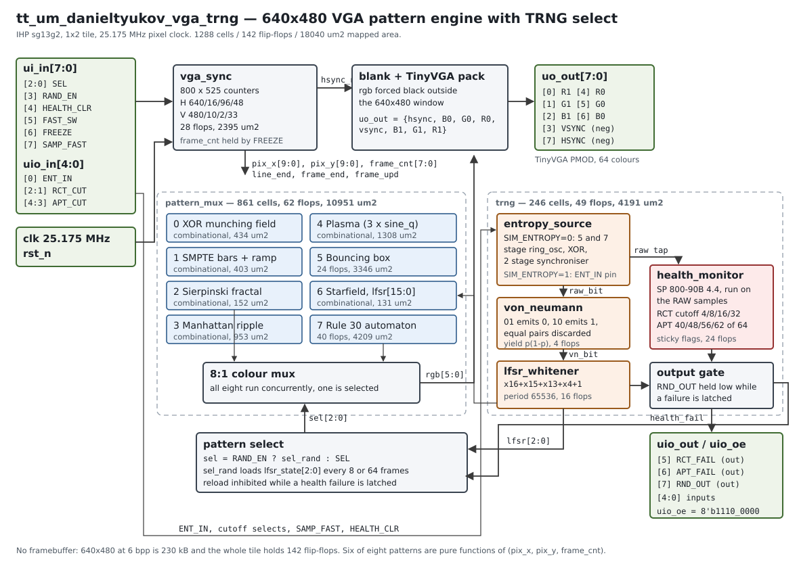

<!---

This file is used to generate your project datasheet. Please fill in the information below and delete any unused
sections.

You can also include images in this folder and reference them in the markdown. Each image must be less than
512 kb in size, and the combined size of all images must be less than 1 MB.
-->

## How it works

Eight 640x480 VGA pattern generators share one sync generator. The active pattern
is chosen either from three input pins or by an on-chip true random number
generator. Colour goes out on the standard TinyVGA PMOD pinout, 2 bits per
channel, 64 colours.



### Video timing

A 25.175 MHz pixel clock and 800 x 525 totals give 640x480 at 59.9405 Hz. Both
syncs are negative polarity: they idle high and pulse low.


```
horizontal   active 640   front 16   sync 96   back 48   total 800
vertical     active 480   front 10   sync  2   back 33   total 525
```

### No framebuffer

A 640x480 frame at 6 bits per pixel is 1 843 200 bits. The whole tile holds 142
flip-flops. Even a single scanline would be 3840 bits. So the colour of a pixel
has to be a function of where the beam is right now, and six of the eight
patterns are pure combinational functions of `(pix_x, pix_y, frame_cnt)`.

The two exceptions hold state much smaller than a line: the bouncing box holds 24
bits of position, direction and colour, and the rule 30 automaton holds 40 bits,
one per cell of 16 pixels. Both are updated during blanking.

### The patterns


| `SEL` | pattern | state | how |
| --- | --- | --- | --- |
| 0 | XOR munching field | none | `(x ^ y) + frame`, colour from three windows of the result |
| 1 | SMPTE style bars + grey ramp | none | eight 75% bars, index `(x >> 4) / 5`, palette rotates with the frame counter |
| 2 | Sierpinski bit fractal | none | `(x & y) == 0`, plus two coarser layers from the same AND term |
| 3 | Manhattan ripple | none | `abs(x-320) + abs(y-240) - frame`, diamonds travel outward |
| 4 | Plasma | none | three interfering sines over a folded quarter wave table |
| 5 | Bouncing box | 24 ff | 32x32 box at 2 px/frame, colour cycles on every wall collision |
| 6 | Starfield | none | star drawn wherever the conditioner's `lfsr[9:0] == 0`, about 300 per frame |
| 7 | Rule 30 automaton | 40 ff | 40 cells, one generation per 32 scanlines, re-seeded each frame |

The ripple animating, and the TRNG picking a new pattern every 8 frames:

| animated pattern | TRNG driven selection |
| --- | --- |
|  |  |

### The random number generator

```
ring_osc(5 stages) \                                  +--> health tests (raw samples)
                    XOR -> synchroniser -> raw_bit ---+
ring_osc(7 stages) /   or the ENT_IN pin              +--> von Neumann -> LFSR
                                                                           |
                                       lfsr[15:0] -> starfield pattern <---+
                                       lfsr[2:0]  -> pattern select   <---+
                                       lfsr[15]   -> RND_OUT pin, health gated
```

- **Noise source.** Two ring oscillators of coprime length (5 and 7 stages) are
  XORed and sampled through a two stage synchroniser, once every 8 pixel clocks
  by default. `SAMP_FAST` drops the divider to 1. `ENT_IN` is XORed into every
  sample, so an external noise source can be injected.
- **Von Neumann debiasing.** Raw samples are taken in non overlapping pairs; an
  unequal pair emits its first bit, an equal pair is discarded. That removes
  static bias exactly, at a cost of p(1-p) output bits per input bit.
- **Conditioning.** A 16 bit LFSR, `x^16 + x^15 + x^13 + x^4 + 1`, with the de
  Bruijn zero state correction so the period is 65536 and the all-zero state
  cannot lock it up. Each debiased bit is XORed into the feedback, so entropy
  accumulates instead of being consumed one bit at a time. The register advances
  every pixel clock, which is what the starfield samples.
- **Health tests.** A repetition count test and an adaptive proportion test in the
  spirit of NIST SP 800-90B section 4.4, both running on the raw samples before
  any conditioning. Cutoffs are selectable on `uio_in[4:1]`. Both failure flags
  are sticky, are visible on `uio_out[6:5]`, and while either is set `RND_OUT` is
  held low and the random pattern reselect is inhibited.

Honest limitation, stated because it matters: a free running ring oscillator has
no meaning in an event driven simulator, so the noise source is parameterised.
`SIM_ENTROPY = 0` keeps the ring oscillators and is what gets taped out.
`SIM_ENTROPY = 1` replaces them with the `ENT_IN` pin, which is what the
testbench uses so the pipeline can be checked bit exactly. Nothing in this
project measures entropy from silicon, and the LFSR conditioner is linear, so
`RND_OUT` must not be treated as a CSPRNG. See the repository README and
`docs/design.md`.

### Area

Yosys mapped against the real IHP `sg13g2` standard cell library: 1288 cells, 142
flip-flops, 18040 um2. A tile is about 167 x 108 um = 18036 um2, so a 1x1 tile
would need 100.0% placement density and does not fit. Two tiles put it at 50.0%,
comfortably inside the 60% target the Tiny Tapeout flow uses.


## How to test

You need a TinyVGA PMOD on the output header and a VGA monitor or capture device.
Clock the design at 25.175 MHz.

1. **Check it locks.** Hold `ui_in = 0x01` to select pattern 1, the SMPTE style
   bar card. You should get eight colour bars with a four step grey ramp along the
   bottom fifth. That confirms sync timing and that all six colour bits reach the
   PMOD.
2. **Walk the patterns.** Sweep `ui_in[2:0]` from 0 to 7 with `ui_in[3]` low. Each
   value should give a visibly different image matching the gallery above.
   Changing `SEL` mid frame is safe and does not disturb sync.
3. **Freeze the animation.** Set `ui_in[6]`. The frame counter stops, so patterns
   0 to 4 and 7 hold still and the bouncing box stops moving. Useful for
   photographing a still.
4. **Let the TRNG drive it.** Set `ui_in[3]` (`RAND_EN`) and `ui_in[5]`
   (`FAST_SW`). The pattern should change every 8 frames, roughly every 130 ms,
   to a value taken from the conditioner state. Clearing `FAST_SW` slows that to
   every 64 frames, about once a second.
5. **Watch the random bit stream.** `uio_out[7]` is the conditioned output. Scope
   it or clock it into a logic analyser. It should look like noise.
6. **Exercise the health tests.** Drive `uio_in[0]` (`ENT_IN`) from a signal
   generator:
   - **Repetition count.** Set `uio_in[2:1] = 0` for a cutoff of 4 and hold
     `ENT_IN` static. `uio_out[5]` should latch high within four samples, and
     `RND_OUT` should go low and stay low.
   - **Adaptive proportion.** Set `uio_in[4:3] = 0` for a cutoff of 40 of 64 and
     drive a heavily biased stream, for example 15 ones then a zero repeated.
     `uio_out[6]` should latch at the end of the first full 64 sample window.
   - **Clear.** Pulse `ui_in[4]` (`HEALTH_CLR`) high. Both flags should clear and
     `RND_OUT` should resume.
7. **Fast entropy sampling.** `ui_in[7]` samples the noise source every clock
   instead of every eight. Useful for collecting a long stream quickly on a bench,
   but note it gives the ring oscillators eight times less time to accumulate
   jitter, so the health tests are more likely to complain. Finding the right rate
   for the fabricated silicon is exactly what this pin is for.

Reset behaviour: after `rst_n` goes low and back high, the beam restarts at pixel
(0,0), the pattern select register is 0, the conditioner reloads its seed
`0x_ACE1`, and both health flags are clear.

## External hardware

- **[TinyVGA PMOD](https://github.com/mole99/tiny-vga)** on the output header.
  This is required: the design drives the standard TinyVGA bit order
  `{hsync, B0, G0, R0, vsync, B1, G1, R1}` and expects that PMOD's resistor
  ladder to turn the 2 bits per channel into an analogue level.
- A VGA monitor or capture device.
- Optional: a signal generator or GPIO driving `uio_in[0]` to test the health
  tests, or to inject an external noise source.
- Optional: a logic analyser on `uio_out[7:5]` to watch the random bit stream and
  the health flags.
